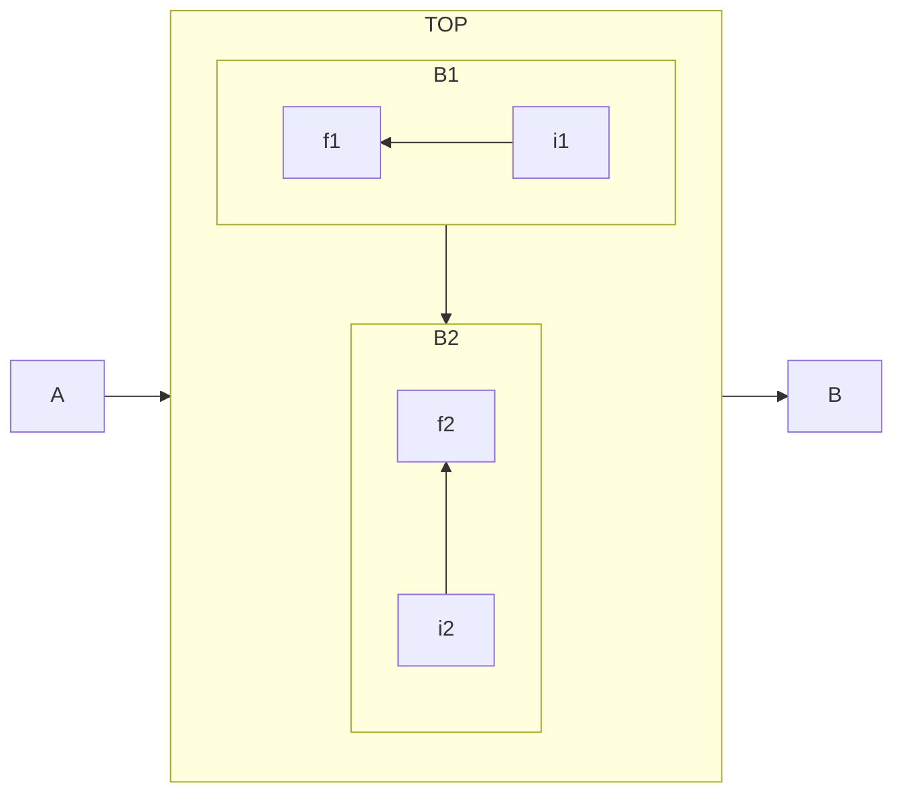

## mermaid.js

Diagrams


| Subject   | Information                                      |
| :-------- | :----------------------------------------------- |
| Flowchart | https://mermaid-js.github.io/mermaid/#/flowchart |

#### Examples

```mermaid
graph LR;
    A(Receive Drawings / Models)-->B(Model / Coordinate MEPs);
    B-->C{Submits};
    C-->D(Subcontractor / Design Feedback);
    D.->B;
    D-->E{Approval}
    E-->F(Approved MEP Drawings) & G(Framing Coordination / Shops)
```


